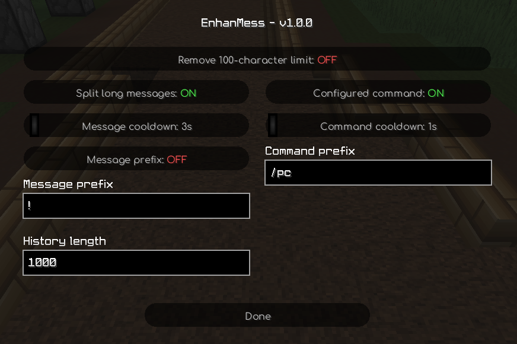

# enhanmess

extends 100-character message limit of 1.8.9 up to 256 characters; queues regular messages & configured commands; adds long message splitting; increases default message history length; adds support for command & regular prefixes

## usage

to configure the mod execute `/em` (short for `/enhanmess`):



or use commands instead:

```
/em toggle

# message prefix
/em mp toggle
/em mp set <prefix>

# command prefix
/em cp toggle
/em cp set <command>

# message cooldown
/em mc set <seconds>

# command cooldown
/em cc set <seconds>

# history
/em h set <lines>
```

P.S. sending more than 100 chars in a single packet works only in singleplayer or on servers that support it, so message splitting is preferred

## installation

you can either install the `.jar` from the releases or build the mod yourself by cloning the repository and running:

### windows

```bat
.\gradlew.bat build
```

### linux

```bash
./gradlew build
```

the built `.jar` will be inside `./build/libs` directory in both cases

## contributions

welcome